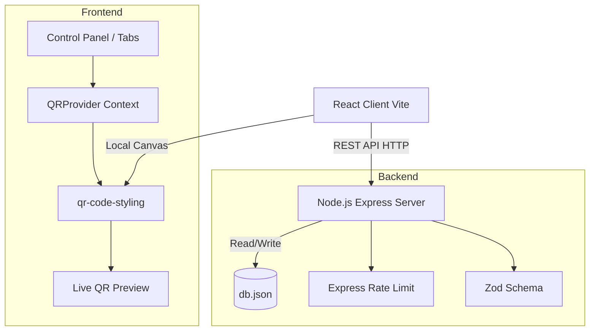
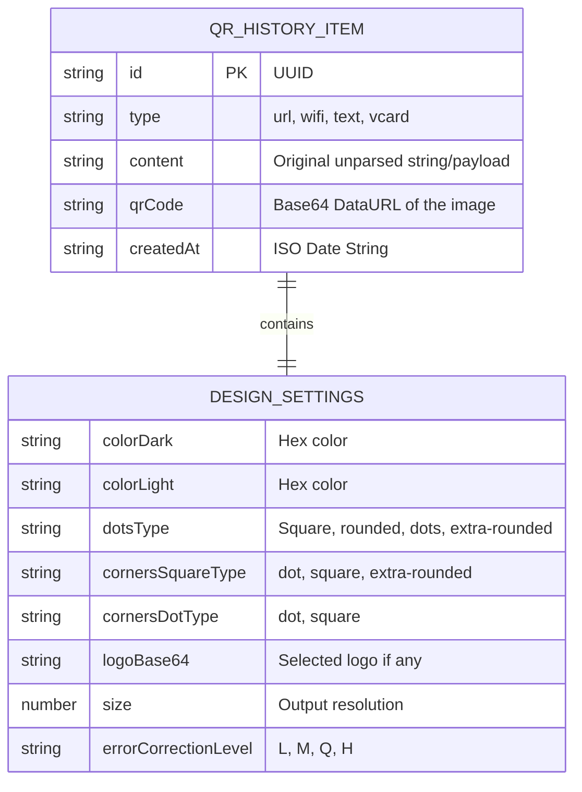

# System Design Document

## 1. User Stories & Acceptance Criteria

### User Story 1: Стилизация QR-кода
**Как** маркетолог,
**Я хочу** настраивать стиль QR-кода (точки, цвета, логотипы),
**Чтобы** он соответствовал гайдлайнам моего бренда.
* **Acceptance Criteria:**
  - Пользователь может выбрать форму точек из 7 вариантов (square, dots, rounded и др.).
  - Доступен выбор цветов (Background/Foreground).
  - Есть возможность загрузить центральный логотип и настроить его размер/отступ.
  - QR-код моментально перерисовывается в превью без перезагрузки страницы (Canvas debounce).

### User Story 2: Поддержка разных типов данных
**Как** участник нетворкинга,
**Я хочу** генерировать QR-коды для vCard контактов и Wi-Fi сетей,
**Чтобы** люди могли легко сохранить мои контакты или подключиться к сети.
* **Acceptance Criteria:**
  - Доступна вкладка "vCard" с обязательными полями (Имя, Телефон, Компания).
  - При выборе вкладки, данные форматируются в стандартный синтаксис `BEGIN:VCARD`.
  - Доступна вкладка "Wi-Fi" с выбором типа шифрования (WPA/WEP/None).

### User Story 3: Сохранение и история загрузок
**Как** активный пользователь,
**Я хочу** сохранять свои генерации в локальную базу данных,
**Чтобы** потом переиспользовать их шаблоны.
* **Acceptance Criteria:**
  - Кнопка "Сохранить в историю" отправляет запрос на бэкенд и сохраняет текущие настройки + Base64 изображение.
  - Сохраненные элементы отображаются во вкладке "История" в виде сетки.
  - Нажатие на элемент в истории восстанавливает его параметры в редакторе.

---

## 2. API Documentation (REST OpenAPI Structure)

Основано на Express-сервере локальной базы `db.json`.

```yaml
openapi: 3.0.0
info:
  title: QR Generator API
  version: 1.0.0
paths:
  /api/qr/generate:
    post:
      summary: Создать новую запись QR-кода в истории
      requestBody:
        required: true
        content:
          application/json:
            schema:
              type: object
              properties:
                type:
                  type: string
                  example: "url"
                content:
                  type: string
                  example: "https://example.com"
                qrCode:
                  type: string
                  description: "Base64 encoded PNG image"
                design:
                  type: object
                  properties:
                    colorDark: { type: string }
                    colorLight: { type: string }
                    dotsType: { type: string }
      responses:
        '201':
          description: QR код успешно сохранен
          
  /api/qr/history:
    get:
      summary: Получить список истории с пагинацией
      parameters:
        - in: query
          name: page
          schema: { type: integer, default: 1 }
        - in: query
          name: limit
          schema: { type: integer, default: 50 }
      responses:
        '200':
          description: Список объектов QR 
          
  /api/qr/{id}:
    delete:
      summary: Удалить конкретный QR из истории
      parameters:
        - in: path
          name: id
          required: true
          schema: { type: string }
      responses:
        '200':
          description: Запись удалена
```

---

## 3. Архитектурная диаграмма



---

## 4. Модель данных (ER Diagram)

Хранение осуществляется в `db.json` массивом объектов. Эта диаграмма показывает структуру каждого такого объекта.



---

## 5. Decision Log (Архитектурные Решения)

| Дата | Решение | Контекст | Рассмотренные альтернативы | Итог (Почему выбрано) |
|---|---|---|---|---|
| 08.03.2026 | Выбор БД для хранения истории | Нужно было хранить историю генераций на Backend | `sqlite3`, `PostgreSQL`, `MongoDB` | Выбран **JSON-файл (`fs`)**. Отказ от SQLite произошел из-за проблем с `node-gyp` и нативной компиляцией C++ на Windows. JSON-файл не требует драйверов и идеально подходит для MVP. |
| 10.03.2026 | Генерация QR: Клиент или Сервер? | Как отрисовывать сложный QR код с логотипом? | `qrcode` (backend), `canvas` на сервере | Выбрана клиентская генерация (`qr-code-styling`). Это разгружает бэкенд, позволяет мгновенно (debounce) обновлять UI без сетевых задержек. |
| 10.03.2026 | Удаление Динамических ссылок | Изначально были добавлены редиректы и nanoId | Сохранить короткие ссылки ради аналитики | Функционал удален. Короткие ссылки работали только при запущенном `localhost:3001`, что делало экспорт QR-кодов бессмысленным для реального использования вне локальной сети. Возврат к полностью статичным QR. |
| 10.03.2026 | Выбор UI-фреймворка | Построение премиум интерфейса | Bootstrap, MaterialUI, ChakraUI | Выбран **Tailwind CSS v4 + Framer Motion**. Обеспечивает максимальную гибкость и создание уникального Glassmorphism-дизайна без "коробочного" вида. |